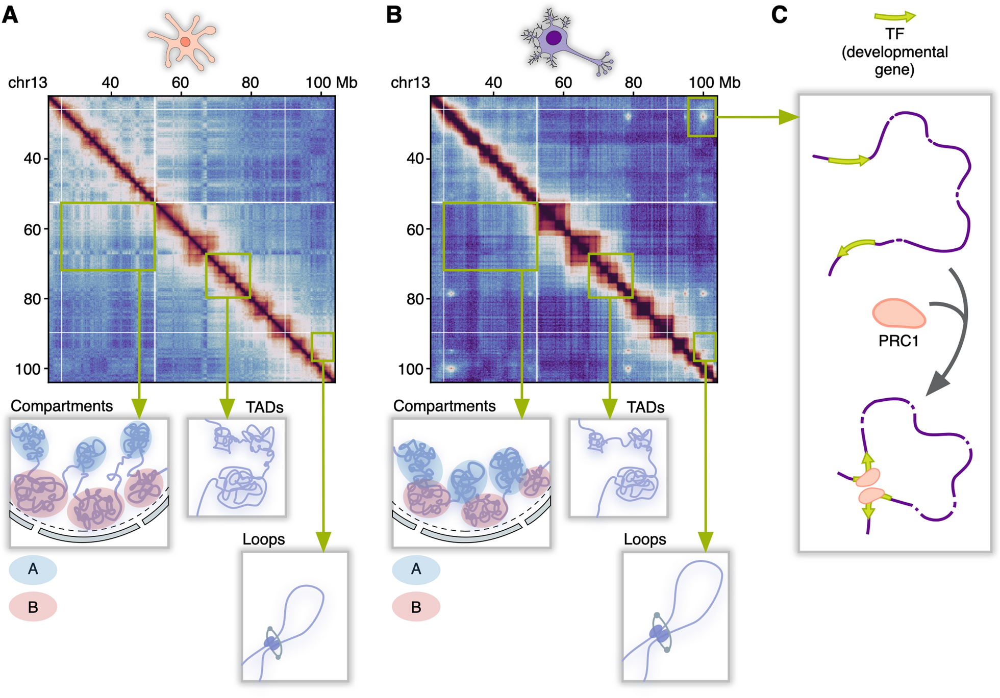

## The Role of Polycomb Group Proteins in Neuronal Chromatin Structure and Epigenetics

> **Nikita Vaulin** Skoltech 
> tg: *@nvaulin*  
> Nikita.Vaulin@skoltech.ru

This is repo for my Master thesis bioinformatics analysis results (Skoltech 2023-2024).

---

### About

**Neurons**, genetically identical to all other cells in our body, nevertheless differ greatly in morphology and function. These differences originate from epigenetic processes going on inside the cell. In this work, we investigate the role of **Polycomb group proteins** – specific repressor and chromatin structuring factors – in the **3D genome, epigenome, and transcriptome of neurons**. We show that Polycomb forms a unique network of long-range loops that propagate gene silencing programmes. Polycomb activity differs in different cell types of the human brain. The genetic basis for these differences lies in the presence of a large pool of subunits, the different assembly of which leads to functionally different Polycomb complexes. Ultimately, we find links between how the genetic diversity of Polycomb was formed and how our nervous system has evolved.

*Keywords:* Polycomb, 3D genome, neurons, epigenetics

#### In previous episodes

This study is the continuation of the [Pletenev 2024 work](###References). Check it out to see the beginning of our Polycomb story!

#### Spin-offs

Some conclusions of this work were used in our recently published review:

+ [Zagirova, D., Kononkova, A., Vaulin, N. et al. From compartments to loops: understanding the unique chromatin organization in neuronal cells. Epigenetics & Chromatin 17, 18 (2024)](https://doi.org/10.1186/s13072-024-00538-6)

The picture above is also taken from this review. Maybe I'll make some beautiful illustrations for this work separately.

### Contents

You can find all the results in the `notebooks` folder:

- [*01_Polycomb_loops_on_HiC_maps.ipynb*](https://github.com/nvaulin/Polycomb_in_neurons_MSc/blob/main/notebooks/01_Polycomb_loops_on_HiC_maps.ipynb)
- [*02_Genes_within_Polycomb_loops.ipynb*](https://github.com/nvaulin/Polycomb_in_neurons_MSc/blob/main/notebooks/02_Genes_within_Polycomb_loops.ipynb)
- [*03_Polycomb_Network.ipynb*](https://github.com/nvaulin/Polycomb_in_neurons_MSc/blob/main/notebooks/03_Polycomb_Network.ipynb)
- *04_Polycomb_Expression.ipynb* (cooming soon)
- *05_RYBP_YAF2_comparison.ipynb* (cooming soon)

### Raw data

Almost all data necessary for the analysis is located in the `data` folder:

- `polycomb_dot_anchors.hand_made.bed` - Polycomb anchors manually marked-up by [Ilya Pletenev](https://github.com/i-pletenev) (💕)
- `polycomb_loops.tsv` and `polycomb_loops_in_single_cells.tsv` - Loops found for the abovementioned anchors.
- `H3K27me3_Neuron.bw`, `H3K27me3_NonNeuron.bw` - ChIP-seq BigWigs from the Dong 2022 work
- `cells_fullmeta_m3C.tsv` - Single-cells metainformation from the Tian 2023 work
- `rnaseq.rizzardi2019...` - Genes expressed in neurons from the Rizzardi 2019 work

Yet, some data is too big for GitHub :((

- `hc_plus.mcool` and `hc_minus.mcool` - Human Brain (BA22p) post-mortem Hi-C maps obtained and described in detail in the [Pletenev 2024 work](###References). You can get them from the GEO (GSE229816). There are individual maps, and here I use maps that were merged using [01_merge_Hi-C.sh](https://github.com/i-pletenev/NeuN_plus_minus_paper/blob/v1.0/code/01_merge_Hi-C.sh) script (`PLUS_MRG_OUT` and `MINUS_MRG_OUT` names).

### References

- [Pletenev IA et al. (2024). Extensive long-range polycomb interactions and weak compartmentalization are hallmarks of human neuronal 3D genome. Nucleic Acids Research, gkae271.](https://doi.org/10.1093/nar/gkae271)
- [Dong P et al. (2022). Population-level variation in enhancer expression identifies disease mechanisms in the human brain. Nature genetics, 54(10), 1493-1503.](https://doi.org/10.1038/s41588-022-01170-4)
- [Rizzardi LF et al. (2019). Neuronal brain-region-specific DNA methylation and chromatin accessibility are associated with neuropsychiatric trait heritability. Nature neuroscience, 22(2), 307-316.](https://doi.org/10.1038/s41593-018-0297-8)
- [Tian W et al. (2023). Single-cell DNA methylation and 3D genome architecture in the human brain. Science, 382(6667), eadf5357.](https://doi.org/10.1126/science.adf5357)